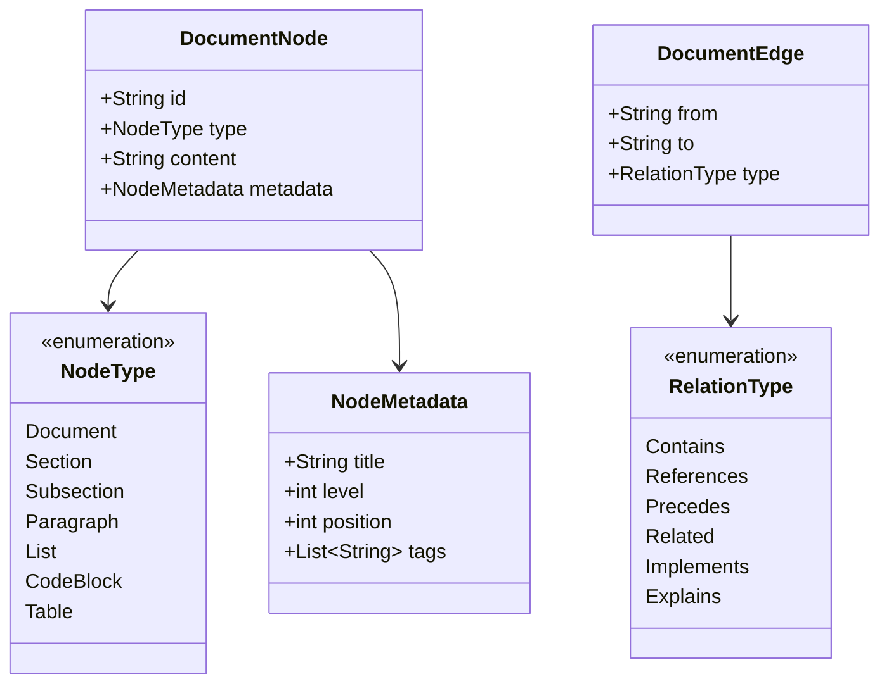
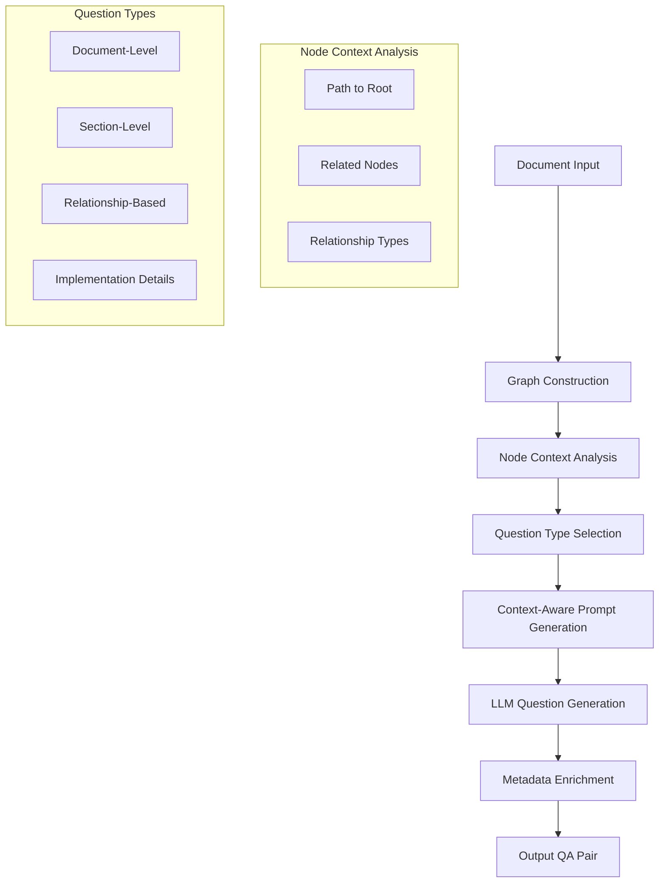
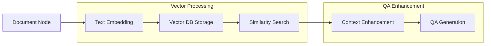

# Graph-Based Document Processing Strategy for LLM Training Data Generation

## Abstract

This document presents a novel approach to generating high-quality training data for Large Language Models (LLMs) by leveraging graph-based document representation. The proposed methodology captures both hierarchical structure and semantic relationships within documentation, enabling the generation of contextually rich question-answer pairs that preserve document relationships and improve training effectiveness.

## 1. Introduction

Traditional approaches to generating question-answer pairs from documentation often treat text segments in isolation, losing valuable contextual information and relationships between different parts of the document. This paper presents a graph-based strategy that preserves these relationships and enables the generation of more sophisticated training data.

## 2. Document Graph Model

### 2.1 Graph Structure

The document is modeled as a directed graph G = (V, E), where V represents document nodes and E represents edges (relationships) between nodes.



### 2.2 Node Types

Nodes in the graph represent different structural elements:

1. Document (root node)
2. Sections (major divisions)
3. Subsections (nested divisions)
4. Paragraphs (text blocks)
5. Lists (enumerated or bulleted)
6. Code Blocks (source code examples)
7. Tables (structured data)

### 2.3 Edge Types

Edges represent relationships between nodes:

1. **Contains**: Hierarchical relationship (A contains B)
2. **References**: Cross-reference relationship
3. **Precedes**: Sequential relationship
4. **Related**: Semantic relationship
5. **Implements**: Implementation relationship
6. **Explains**: Explanatory relationship

## 3. Question Generation Strategy

### 3.1 Context-Aware Question Generation



### 3.2 Question Categories

Questions are generated with different levels of abstraction and relationship awareness:

1. **Document-Level Questions**
   - Overall purpose and scope
   - Main themes and concepts
   - Architectural decisions

2. **Section-Level Questions**
   - Section-specific concepts
   - Relationship to parent sections
   - Implementation details

3. **Relationship-Based Questions**
   - Cross-reference understanding
   - Concept dependencies
   - Implementation relationships

4. **Statistical Questions**
   - Metrics and measurements
   - Performance characteristics
   - Comparative analysis

## 4. Implementation

### 4.1 Graph Construction

```rust
pub struct DocumentGraph {
    nodes: HashMap<String, DocumentNode>,
    edges: Vec<DocumentEdge>,
}

impl DocumentGraph {
    pub fn from_document(content: &str) -> Result<Self> {
        // 1. Parse document structure
        // 2. Create nodes for each element
        // 3. Establish relationships
        // 4. Build edge connections
    }
}
```

### 4.2 Question Generation

```rust
pub struct QuestionGenerator {
    graph: DocumentGraph,
    llm_client: Box<dyn LLMClient>,
}

impl QuestionGenerator {
    pub async fn generate_questions(&self, node: &DocumentNode) -> Result<Vec<ProcessedItem>> {
        // 1. Analyze node context
        // 2. Select question types
        // 3. Generate context-aware prompts
        // 4. Process LLM responses
        // 5. Enrich with metadata
    }
}
```

## 5. Output Format

Generated question-answer pairs include rich contextual metadata:

```json
{
    "question": "How does the error handling mechanism integrate with the retry system?",
    "answer": "The error handling mechanism integrates with the retry system by...",
    "context": {
        "node_id": "error_handling_section",
        "path": ["api_reference", "client", "error_handling"],
        "related_nodes": ["retry_mechanism", "error_types"],
        "relationships": [
            {
                "target_node": "retry_mechanism",
                "relation_type": "Implements",
                "description": "Uses retry mechanism for handling transient errors"
            }
        ]
    }
}
```

## 6. Advantages

1. **Preserved Context**: Questions maintain awareness of their position in the document hierarchy
2. **Relationship Awareness**: Generated questions can reference related concepts
3. **Improved Training**: LLMs can learn document structure and relationships
4. **Flexible Abstraction**: Support for different levels of detail and abstraction

## 7. Future Work

1. **Dynamic Graph Updates**: Real-time graph updates as documentation changes
2. **Semantic Analysis**: Enhanced relationship detection using NLP
3. **Question Chain Generation**: Generate sequences of related questions
4. **Automated Validation**: Verify question-answer pair consistency with graph structure

## 8. Vector Database Integration

### 8.1 Vector Embedding Strategy



### 8.2 Node Vectorization

Each node in our document graph is embedded into a high-dimensional vector space:

1. **Embedding Levels**:
   - Document-level embedding
   - Section-level embedding
   - Paragraph-level embedding
   - Code block embedding

2. **Embedding Features**:
   ```json
   {
       "node_id": "error_handling_section",
       "vector": [...],  // High-dimensional embedding
       "metadata": {
           "type": "Section",
           "path": ["api_reference", "client", "error_handling"],
           "neighbors": ["retry_mechanism", "error_types"]
       }
   }
   ```

### 8.3 Vector Database Applications

1. **Semantic Similarity Detection**:
   - Find semantically related sections across documents
   - Identify similar implementation patterns
   - Discover conceptual relationships not explicit in the graph

2. **Context Enrichment**:
   ```mermaid
   flowchart TD
       A[Current Node] --> B[Vector Search]
       B --> C[Top K Similar Nodes]
       C --> D[Context Pool]
       D --> E[Enhanced QA Generation]

       subgraph "Similarity Analysis"
           F[Cosine Similarity]
           G[Euclidean Distance]
           H[Dot Product]
       end

       B --> F
       B --> G
       B --> H
   ```

3. **Cross-Document Relationships**:
   - Link related concepts across different documents
   - Build knowledge graphs spanning multiple documents
   - Identify prerequisite relationships

### 8.4 Implementation Strategy

```rust
pub struct VectorizedNode {
    node: DocumentNode,
    embedding: Vec<f32>,
    metadata: VectorMetadata,
}

pub struct VectorDatabase {
    engine: Box<dyn VectorStore>,
    dimension: usize,
    index_config: IndexConfig,
}

impl VectorDatabase {
    pub async fn find_similar(&self, node: &VectorizedNode, k: usize) -> Vec<SimilarNode> {
        // Find k-nearest neighbors in vector space
    }

    pub async fn enhance_context(&self, node: &VectorizedNode) -> EnhancedContext {
        // Build richer context using vector similarity
    }
}

pub struct QAGenerator {
    graph: DocumentGraph,
    vector_db: VectorDatabase,
    llm_client: Box<dyn LLMClient>,
}

impl QAGenerator {
    pub async fn generate_enhanced_qa(&self, node: &DocumentNode) -> Vec<EnhancedQA> {
        // 1. Get node embedding
        let vectorized = self.vector_db.vectorize(node);

        // 2. Find similar nodes
        let similar = self.vector_db.find_similar(&vectorized, 5).await;

        // 3. Build enhanced context
        let context = self.vector_db.enhance_context(&vectorized).await;

        // 4. Generate QA pairs with enhanced context
        self.generate_qa_with_context(node, context).await
    }
}
```

### 8.5 Enhanced QA Output

```json
{
    "question": "How does the error handling mechanism work?",
    "answer": "The error handling mechanism...",
    "context": {
        "graph_context": {
            "node_id": "error_handling_section",
            "path": ["api_reference", "client", "error_handling"]
        },
        "vector_context": {
            "similar_sections": [
                {
                    "node_id": "retry_mechanism",
                    "similarity": 0.92,
                    "relationship": "implementation"
                },
                {
                    "node_id": "error_types",
                    "similarity": 0.87,
                    "relationship": "reference"
                }
            ],
            "cross_document_refs": [
                {
                    "doc": "error_handling_guide.md",
                    "section": "best_practices",
                    "similarity": 0.85
                }
            ]
        }
    }
}
```

### 8.6 Benefits of Vector Integration

1. **Semantic Understanding**:
   - Capture semantic relationships not explicit in document structure
   - Find similar concepts across different documents
   - Identify implicit relationships

2. **Enhanced Context**:
   - Richer context for QA generation
   - Cross-document knowledge integration
   - Better prerequisite identification

3. **Quality Improvements**:
   - More relevant questions
   - Better coverage of related concepts
   - Reduced redundancy in QA pairs

4. **Scalability**:
   - Efficient similarity search
   - Handle large document collections
   - Cross-repository knowledge linking

## 9. Dual-Use Capability

The graph-based document representation with vector embeddings supports two primary use cases:

### 9.1 Enhanced QA Generation

The graph structure enhances QA pair generation by:
- Leveraging node relationships for contextually richer questions
- Using vector embeddings to identify semantically related content
- Preserving document hierarchy in generated training pairs
- Enabling relationship-aware question generation

### 9.2 RAG Pipeline Integration

The same graph structure supports RAG pipelines by:
- Storing vector embeddings per node for efficient similarity search
- Maintaining relationship context for improved retrieval
- Providing structured metadata for filtering and ranking
- Enabling graph traversal for context expansion

### 9.3 Implementation Considerations

```rust
pub struct DocumentNode {
    // Existing fields...
    vector_embedding: Option<Vec<f32>>,
    rag_metadata: Option<RAGMetadata>,
}

pub struct RAGMetadata {
    chunk_size: usize,
    overlap: usize,
    embedding_model: String,
    timestamp: DateTime<Utc>,
}

impl DocumentGraph {
    pub fn export_for_rag(&self) -> Result<Vec<RAGChunk>> {
        // Export graph nodes with embeddings for RAG
    }

    pub fn generate_qa_pairs(&self) -> Result<Vec<QAPair>> {
        // Generate enhanced QA pairs using graph structure
    }
}
```

This dual-use capability allows the same document processing pipeline to serve both training data generation and retrieval-augmented generation use cases, maximizing the utility of the graph-based representation.

## 10. References

1. Graph-based document representation in NLP
2. Hierarchical attention networks for document classification
3. Knowledge graph approaches to text understanding
