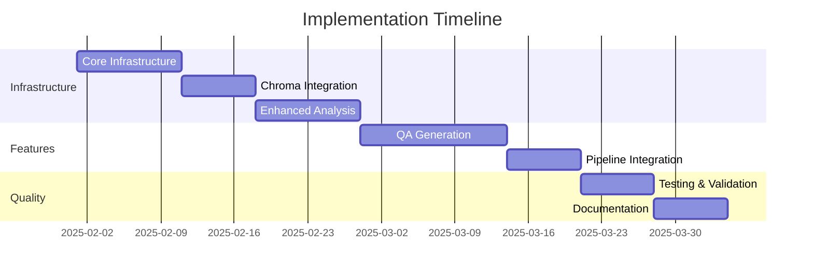

# Implementation Plan for Enhanced QA Generation with Graph-Based Processing

This document outlines the implementation plan for enhancing our QA pair generation using graph-based document processing while maintaining compatibility with the current output format. We'll use Chroma as our local vector store for improved semantic processing.

## Phase 1: Core Infrastructure

### 1.1 Base Data Structures
- [ ] Implement `DocumentNode` structure with:
  - Basic metadata (id, type, content)
  - Vector embedding support
- [ ] Implement `DocumentEdge` with relationship types
- [ ] Create `DocumentGraph` structure

### 1.2 Chroma Integration
- [ ] Set up Chroma client with local persistence
- [ ] Implement embedding generation pipeline
- [ ] Create efficient vector storage and retrieval system
- [ ] Add batch processing support

### 1.3 Graph Construction
- [ ] Implement document parsing pipeline
  - Markdown support
  - Code block handling
  - Section/subsection detection
- [ ] Build node creation logic
- [ ] Implement edge creation and relationship detection
- [ ] Add vector embedding generation for nodes

## Phase 2: Enhanced Analysis

### 2.1 Context Analysis
- [ ] Implement path-to-root analysis
- [ ] Build related nodes detection
- [ ] Create relationship type analyzer
- [ ] Add semantic similarity computation using Chroma

### 2.2 Graph Traversal
- [ ] Implement basic graph traversal algorithms
- [ ] Add context window management
- [ ] Create relationship-aware path finding
- [ ] Build subgraph extraction utilities

## Phase 3: Enhanced QA Generation

### 3.1 Question Generation
- [ ] Implement context-aware prompt generation
- [ ] Create question type selector based on node relationships
- [ ] Build semantic similarity-based context enrichment
- [ ] Add relationship-based question refinement

### 3.2 Answer Generation
- [ ] Implement answer context collection
- [ ] Create answer validation using graph context
- [ ] Add semantic verification using Chroma
- [ ] Ensure output compatibility with current format:
  ```json
  {
    "question": "string",
    "answer": "string"
  }
  ```

## Phase 4: Pipeline Integration

### 4.1 Processing Pipeline
- [ ] Create pipeline configuration system
- [ ] Implement processing stages
- [ ] Add progress tracking
- [ ] Build pipeline optimization
- [ ] Ensure persistence of Chroma collections

### 4.2 Output Management
- [ ] Implement JSONL output formatter
- [ ] Add Chroma collection export utilities
- [ ] Create backup and versioning system
- [ ] Add collection sharing tools

## Phase 5: Testing & Validation

### 5.1 Unit Testing
- [ ] Core data structure tests
- [ ] Graph operations tests
- [ ] QA generation tests
- [ ] Chroma integration tests

### 5.2 Integration Testing
- [ ] End-to-end pipeline tests
- [ ] Performance benchmarks
- [ ] Memory usage optimization
- [ ] Chroma persistence tests

## Phase 6: Documentation & Examples

### 6.1 Documentation
- [ ] API documentation
- [ ] Usage guides
- [ ] Vector store management guide
- [ ] Performance guidelines

### 6.2 Examples
- [ ] Basic usage examples
- [ ] Custom pipeline examples
- [ ] Collection management examples
- [ ] Performance optimization examples

## Timeline & Dependencies



## Success Criteria

1. **Performance Metrics**
   - Graph construction time < 1s for typical documentation files
   - QA generation latency < 2s per pair
   - Chroma query latency < 50ms
   - Test coverage > 90%

2. **Quality Metrics**
   - QA pair relevance score > 0.8
   - Context preservation accuracy > 90%
   - Output format compliance: 100%

## Next Steps

1. Begin with Phase 1 implementation
2. Set up Chroma development environment
3. Create initial test suite
4. Start documentation framework

## Risk Mitigation

1. **Technical Risks**
   - Large document performance: Implement streaming processing
   - Memory usage: Use chunked processing
   - Chroma persistence: Regular backups and validation

2. **Project Risks**
   - Timeline slippage: Regular progress tracking
   - Integration issues: Early prototyping
   - Quality concerns: Continuous testing
